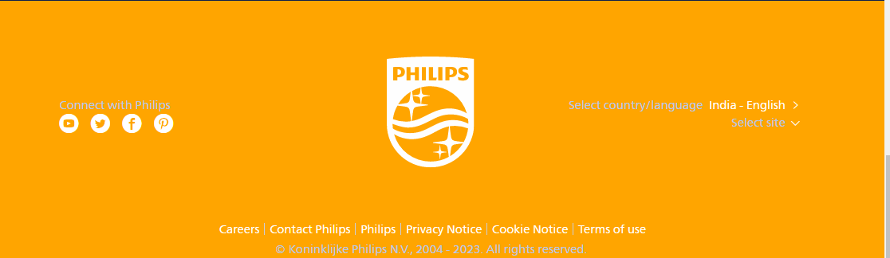

# iNeuron-JavaScript-DOM-Assignment


1.Website Name: [Dev To](https://dev.to/)

## Topic

```
Query Selctory, Inner HTML
```

## Sample Image


## Task

```
Target the Top description div and change the DEV Community to <Your_Name> and description to your passion
```    

## Solution


2.Website Name: [Apple](https://support.apple.com/en-in)

## Task


## Solution
```
const listNsmr = document.querySelectorAll(".as-imagegrid-item");
//console.log(listNsmr)
const storeValHouse =  [];
listNsmr.forEach((item)=>{
let x = item.innerText.replace("\nSupport", "");
storeValHouse.push(x);
})
console.log(storeValHouse)
```
['iPhone', 'Mac', 'iPad', 'Watch', 'AirPods', 'Music', 'TV']


3.Website Name: [Youtube Support](https://support.google.com/youtube/#topic=9257498)

## Topic

```
Get Element By Id, Create Element, Create Text Node, Append Child
```

## Sample Image


## Task
```
Add another FAQ 'My New FAQ' to the list
```

## Solution

```
const targetMain = document.querySelector(".accordion-homepage");
const addSection = document.createElement("section");
addSection.className = "parent";
const addTag = document.createElement("h3");
addTag.textContent = "My New FAQ"
targetMain.appendChild(addSection)
addSection.appendChild(addTag);
```


4.Website Name:[OnePlus](https://service.oneplus.com/in)

## Topic
```
Query Selector, InnerText
```
## Sample Image


## Task

```
Change the contact number
```
## Solution

```
document.querySelector(".customer-support a").innerText = '+919962929448'
```


5.Website Name: [Samsung](https://www.samsung.com/in/offer/online/samsung-fest/)

## Topic

```
getElementById, createElement, InnerText, append, setAttribute
```
## Task
```
Target the main div of card and change the Button text to Check out
```
## Solution


6.Website Name:[Adidas](https://www.adidas.co.in/)


## Topic

```
Query Selector, Event listeners, Changing Styles
```

## Task

```
Target the search box and on hover change thebackground color to red.
```

## Solution

```
  const find = document.querySelector(".searchinput___19uW0")
  find.addEventListener("mouseover", changbg)
  function changbg(){
  find.style.backgroundColor = "red"
  };

  /*or*/
             document.querySelector(".searchinput___zXLAR").addEventListener("mouseover", function() {
 document.querySelector(".searchinput___zXLAR").style.   backgroundColor = "red";
 });
 ```
 
 7.Website Name: [MDN Web Docs](https://developer.mozilla.org/en-US/)
 
 ## Topic
 
 ```
 Form, Value, Submit
```

## Task

```
To Search a topic in the MDN Search bar.
First add a text to search in the search bar and then hit the submit search button to search the docs using DOM
```

## Solution


```
let form = document.getElementById("hp-search-form");

form.querySelector("input").value = "CSS Selector";

form.submit();
```


8.Website Name: [Google](https://www.google.com/)

## Topic

```
Remove Elements
```

## Task

```
 Remove alternate languages from the home page languages listed
```

## Solution


```
let x = document.querySelectorAll('.z4hgWe a')
x.forEach((a,index)=>{
index % 2 == 0 && a.remove()
})
```

9.Website Name: [Code Wars](https://www.codewars.com/)

## Topic

```
   Change Font Family, Color of Text.
```   

## Task

```
Change the font family of the text to monospace and text color to the logo’s background color.
```

## Solution


```
document.querySelector(".text-align-center").style.fontFamily="monospace";
document.querySelector(".text-align-center").style.fontFamily="orange";
```

10.Website Name: [Freecodecamp](https://www.freecodecamp.org/)

## Topic

```
querySelector, mouseover, click eventListener,  callback function, style
```

## Task

```
Target the button and change background colour on mouseover
```

## Solution


```
  document.querySelector(".btn-cta-big .login-btn-text ").addEventListener("mouseover",function(){

  document.querySelector(".btn-cta-big .login-btn-text ").style.backgroundColor="red"
```  

11.Website Name: [realme](https://www.realme.com/in/)

## Topic

```
   querySelector,style,background-image
```

## Task

```
change the realme logo to ineuron logo
```


 
## Solution

```
document.querySelector(".gtag .icon").style.backgroundImage="url('https://ineuron.ai/images/ineuron-logo.png')"
```

12.Website Name: [Github](https://github.com/new)

## Topic

```
   Change Font Family, Color of Text.
```   

## Task

```
 change the background colour of the button to blue.
```


## Solution

```
document.querySelector(".Subhead mb-3 , h1").style.backgroundColor = "blue"

document.querySelector(".Subhead mb-3 , h1").style.fontFamily = "roman"
```

13.Website Name: [Hackerrank](https://www.hackerrank.com/)

## Topic

```
   querySelector,innerHtml
```

## Task

```
Target the top description and change “Matching developers with great companies” to JSBOOTCAMP.
```


## Solution

```
 document.querySelector("h1 span").innerHTML = "JSBOOTCAMP"
``` 

14.Website Name: [Asus](https://www.asus.com/in/)

## Topic

```
  querySelector,style,font-size
``` 

## Task 

```
   change the fontsize of “Hot Deals” to 80px
```   


## Solution

```
 document.querySelector(".HotDealsAll__Heading__2fIbe").style.fontSize = "80px"
```

15.Website Name: [Dell](https://www.dell.com/en-in/shop/deals/laptop-deals?gacd=10415953-9016-5761040-285981356-0&dgc=ST&gclid=Cj0KCQjwguGYBhDRARIsAHgRm4-XUDMhhVNyHXb3s1gY4ZBzORr_d9Se-buhJwy7asyUe7YdqEA11eEaAt6UEALw_wcB&gclsrc=aw.ds&nclid=BxjBlpBQsX6pjSHh-L8YYSU77EpfXRkG1AGMB5Wbeu386ykspfrPDnfx_DdFau20)


## Topic

```
  querySelector,style.textAlign
```

## Task

```
   Convert the text “G15 Gaming Laptop” from left to right
```


## Solution

```
document.querySelector(".btn-container").innerHTML=new Date()
```

16.Website Name: [Vercel](https://vercel.com/)

## Topic

```
 querySelector,innerHTMl
```

## Task

```
  change the heading “Start with the developer” to “Start with Scratch”
```


```
document.querySelector(".section-title_title__VEDfK").innerHTML= "Start with Scratch"
```

17.Webiste Name: [Sony](https://www.sony.co.in/)

## Topic

```
querySelector,innerHTMl
```

## Task

```
 change the button text To current Date.
```


## Solution

```
let date = new Date; document.querySelector(".btn-container").innerText = date;
```

18.Webiste Name: [Philips](https://www.philips.co.in/)

## Topic

```
 querySelector,style,backgroundcolor
```

## Task

```
change the background colour blue to orange
```



## Solution

```
document.querySelector(".p-footer").style.background = "orange";
```

19.Webiste Name: [Canon](https://in.canon/en/consumer)

## Topic

```
      querySelector,src
```

## Task

```
extract the canon logo
```

## Solution

```
document.querySelector(".logo").src;
```


20.Webiste Name: [Oppo](https://www.oppo.com/in/)

## Topic

```
      querySelector,style,color
```

## Task

```
  Change the description colour black to Red
```


## Solution

```
document.querySelector(".desc").style.color = "red";
```


